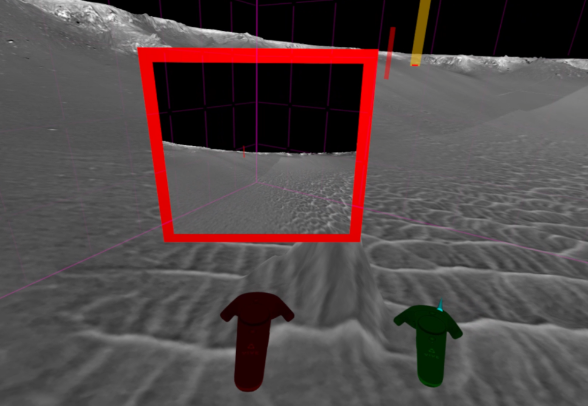

This repository contains the code for the master thesis 
*How can I get there? Disorientation and motion sickness effects depending on the virtual reality navigation technique* **by Marc Domenech Lopez**.

The thesis itself can be found in [thesis](./thesis/Marc-Lopez-2019-Master-Thesis.pdf)

The experiments were carried out using the Victoria Crater SuperResolution dataset:
HiRISE_VictoriaCrater_SuperResolution: 5cm orthorectified Super Resolution Restoration (SRR) image created from 6-image input by Tao & Muller (2016) using the GPT algorithm. See 'Tao, Y.; Muller, J.-P. (2016) A novel method for surface exploration: Super-resolution restoration of Mars repeat-pass orbital imagery. Planetary and Space Science, 121, 103–114.doi:10.1016/j.pss.2015.11.010'

Running the demo `Tansportation.Thesis` download the data from http://download.vrvis.at/acquisition/32987e2792e0/PRo3D/VictoriaCrater.zip and place the subfolder `HiRISE_VictoriaCrater_SuperResolution` it beside the executeable in a folder called data.

For convinience, a prebuilt version which was used for the experiments is listed as release (this one was compiled for windows). The startup program in this particular build is called `Aardvark.VR.Demo.exe` in the publish folder - the rest of the directory structure should work out of the box (with data one level up beside the publish folder).

**Thanks to Marc for his great work!**
